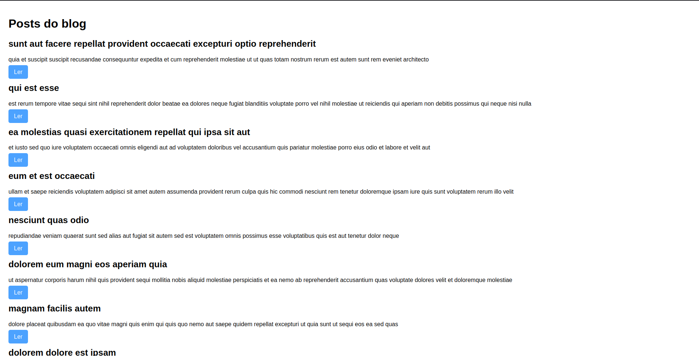

# Blog

Esse projeto foi realizado como desafio da aula [APRENDA FETCH API DE JAVASCRIPT COM PROJETO](https://www.youtube.com/watch?v=qIGYM4S8x50&list=PLnDvRpP8BneysKU8KivhnrVaKpILD3gZ6&index=59) do canal Matheus Battisti - Hora de Codar.

O projeto tinha por objetivo vislumbrar, de forma bem simples, o funcionamento de um blog, onde receberíamos os posts via API e manipular os dados recebidos.

## O Desafio

Nesse projeto foi trabalho conceitos interessantes, por exemplo, receber dados de uma API externa [(JSONPlaceholder)](https://jsonplaceholder.typicode.com/), com o objetivo de demonstrar o funcionamento da função fetch do JS.

O projeto também proporcionou o entendimento de funções assíncronas e promisses, já que para exibir os dados na tela era necessário aguardar a resposta da API, que repassava os dados tanto dos post quanto dos comentários fictícios.

Um desafio proposto nesse projeto também foi receber dados através dos parâmetros da URL através da API própria do JS chamada URLSearchParams. Essa API era usada para receber os dados de identificação de determinado post para este fosse exibido numa outra tela.

Além disso, também foi proposto que fosse possível criar um novo comentário para determinado post. Assim, foi trabalhado conceitos de criação de dados e uso do parâmetro method dentro do método fetch, para enviar os dados para a API.

## Conheça o projeto

[Acesse o projeto no ar aqui](https://thiagoomatheus.github.io/projects/blog/index.html)

[Acesse o código aqui](https://github.com/thiagoomatheus/projects/tree/main/blog)

## Tecnologias/Conhecimentos Utilizados

- HTML Básico
- CSS Básico
- JavaScrip Intermediário
    - Async
    - Await
    - Promisses
    - Receber dados via API
    - Manipulação de Arrays
    - Manipulação de DOM
    - Inserção de dados via API

## Autor

- [thiagoomatheus](https://github.com/thiagoomatheus)
