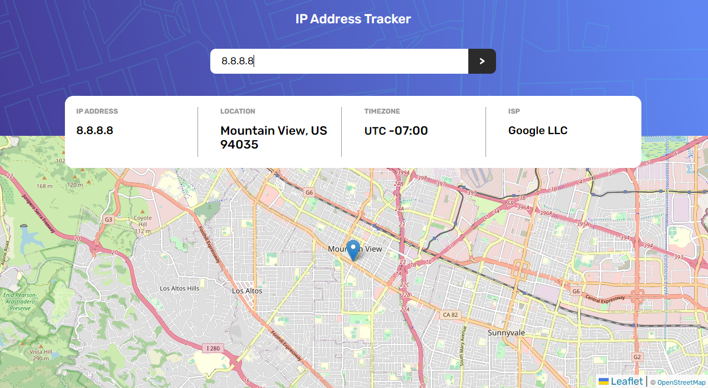
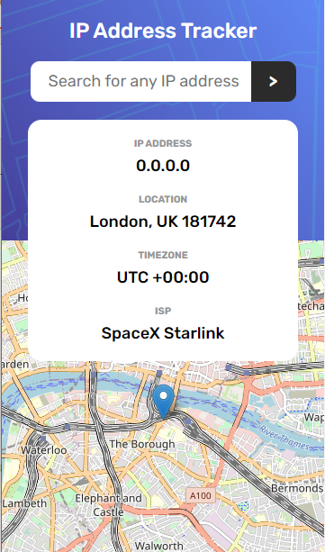

# Frontend Mentor - IP address tracker solution

This is a solution to the [IP address tracker challenge on Frontend Mentor](https://www.frontendmentor.io/challenges/ip-address-tracker-I8-0yYAH0). Frontend Mentor challenges help you improve your coding skills by building realistic projects. 

## Table of contents

- [Overview](#overview)
  - [The challenge](#the-challenge)
  - [Screenshot](#screenshot)
  - [Links](#links)
- [My process](#my-process)
  - [Built with](#built-with)
  - [What I learned](#what-i-learned)
- [Author](#author)

## Overview

### The challenge

Users should be able to:

- View the optimal layout for each page depending on their device's screen size
- See hover states for all interactive elements on the page
- See their own IP address on the map on the initial page load
- Search for any IP addresses and see the key information and location

### Screenshot

## Desktop Preview

## Mobile Preview

### Links

- Solution URL: [GitHub](https://github.com/thiagoomatheus/projects/tree/main/ip-address-tracker-master)
- Live Site URL: [GitHub Pages](https://thiagoomatheus.github.io/projects/ip-address-tracker-master/)

## My process

### Built with

- Semantic HTML5 markup
- CSS custom properties
- CSS Grid
- Mobile-first workflow
- JS
  - DOM Manipulation
  - Events
  - Async Function
  - API

### What I learned

This project helped me to fix the concepts previously learned about using APIs. With this project I was able to use the fetch request and handle the data coming from the API.

This project also reinforces the importance of JSON for data manipulation. I could see how much this process is facilitated by this data formatting pattern.

## Author

- GitHub - [thiagoomatheus](https://github.com/thiagoomatheus/)
- Frontend Mentor - [@yourusername](https://www.frontendmentor.io/profile/thiagoomatheus)
