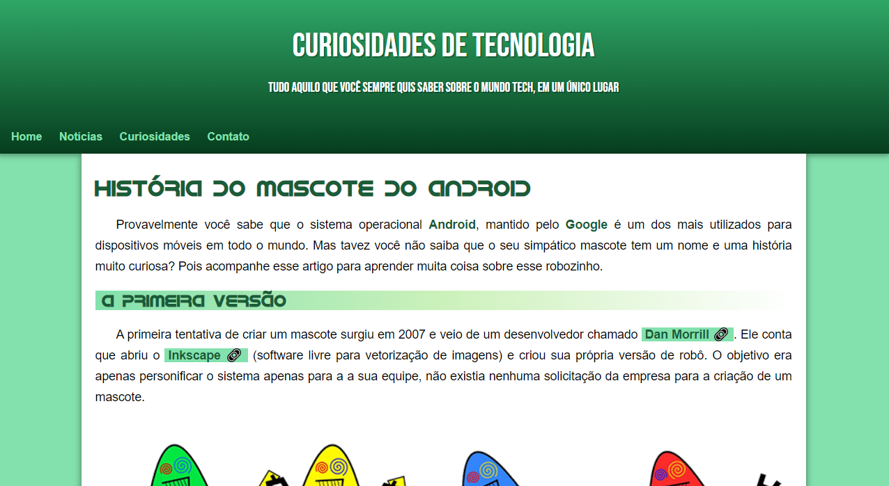
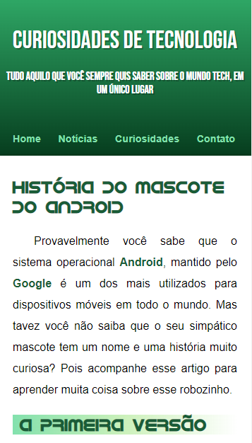

# Projeto Android

Esse projeto foi realizado com base no desafio proposto na aula 08, do capítulo 16, do módulo 2 do curso de HTML5 e CSS3 da plataforma Curso em Vídeo.

## O Desafio

Nesse desafio recebemos o layout do projeto, as fontes, as cores, as imagens e os textos a serem inseridos, necessitando tranformar em código o que estávamos vendo. Este também foi o primeiro desafio em que criamos um repositório próprio para ele, com o propósito de podermos compartilhá-lo usando o recurso do GitHub Pages.

O layout do projeto era baseado em box-model e foi utilizado a plataforma MockFlow para fazer o planejamento da estrutura. As cores foram geradas através do Adobe Color prezando uma palheta de cores monocromática. E, as fontes foram adquiridas nas plataformas Google Fonts e dafonte.com.

Esse projeto tinha com base fixar os conhecimentos adquiridos anteriormente sobre psicologia das cores, tipografia, seletores CSS e box-model, além de implementar o básico de responsividade no projeto.

## Conheça o projeto

[Acesse o projeto no ar aqui](https://thiagoomatheus.github.io/projects/projeto-android/index.html)

[Acesse o código aqui](https://github.com/thiagoomatheus/projects/tree/main/projeto-android)

## Tecnologias/Conhecimentos Utilizados

- HTML Básico
- CSS Básico
- Box-model
- Responsividade Básica
- Psicologia das Cores
- Tipografia
- GitHub Pages

## Autor

- [thiagoomatheus](https://github.com/thiagoomatheus)
