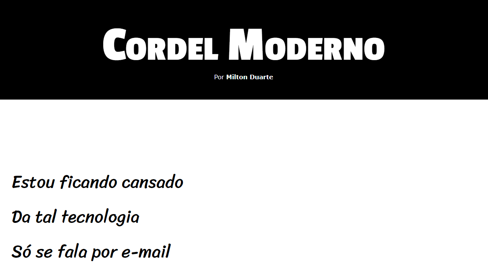
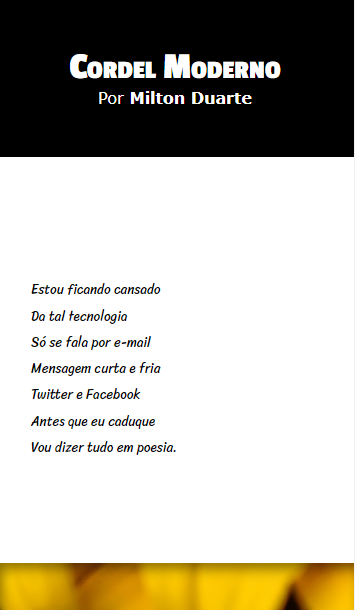

# Projeto Cordel

Esse projeto foi realizado com base no desafio proposto na aula 01, do capítulo 20, do módulo 3 do curso de HTML5 e CSS3 da plataforma Curso em Vídeo.

## O Desafio

Esse desafio consistia em desenvolver uma página dividida em seções. Onde essas seções eram os versos de um poema, formando um cordel digital. Algumas seções deviam ter uma imagem ao fundo do verso com efeito parallax. O desafio tinha como objetivo fixar os conceitos aprendidos nas aulas anteriores sobre backgrouds.

## Conheça o projeto

[Acesse o projeto no ar aqui](https://thiagoomatheus.github.io/projects/projeto-cordel/index.html)

[Acesse o código aqui](https://github.com/thiagoomatheus/projects/tree/main/projeto-cordel)

## Tecnologias/Conhecimentos Utilizados

- HTML Básico
- CSS Básico
- Box-model
- Efeito Parallax simples
- GitHub Pages

## Autor

- [thiagoomatheus](https://github.com/thiagoomatheus)
 
