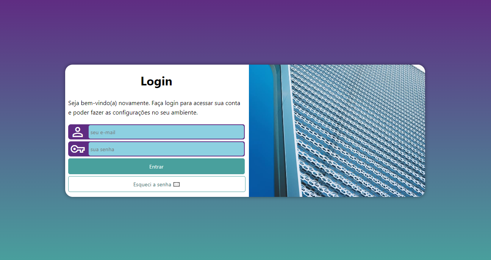
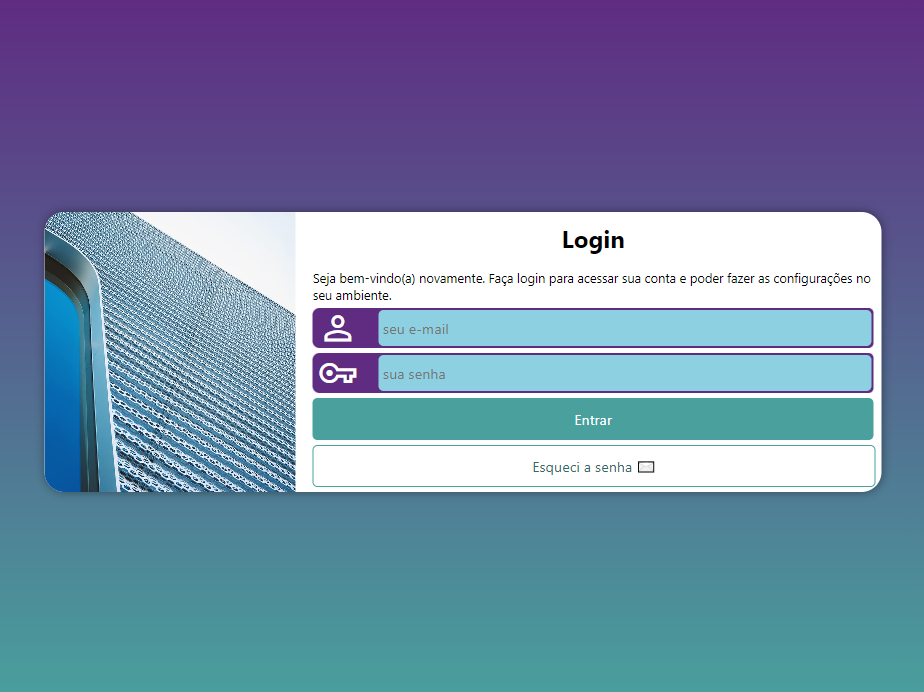
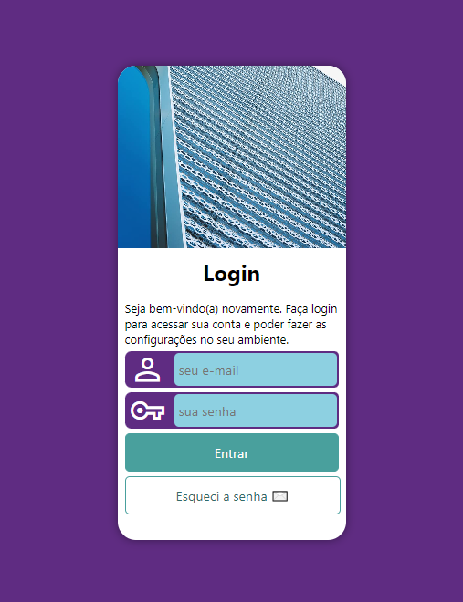

# Projeto Login

Esse projeto foi realizado com base no desafio proposto na aula 01, do capítulo 26, do módulo 4 do curso de HTML5 e CSS3 da plataforma Curso em Vídeo.

## O Desafio

O desafio foi sugerido pelo professor Gustavo Guanabara como conclusão do módulo do curso para fixar os conhecimentos estudados nos capítulos anteriores. Ele consistia em codar uma tela de login, contendo uma seção centralizada na tela com uma imagem e um formulário, que se adaptava a diferentes formatos de tela.

Alguns dos conhecimentos aprofundados nesse projeto foram o uso das tags form, label, input e seus atributos, além de conceitos de responsividade, incluindo device breakpoints e media queries.

Esse foi meu primeiro desafio em que utilizei media queries de forma confiante, sabendo o que estava fazendo, e isso foi fundamental para que aplicasse esse conceito tão importante nos projetos que fiz adiante.

## Conheça o projeto

### Versão Desktop

### Versão Tablet

### Versão Smartphone

[Acesse o projeto no ar aqui](https://thiagoomatheus.github.io/projects/projeto-login/index.html)

[Acesse o código aqui](https://github.com/thiagoomatheus/projects/tree/main/projeto-login)

## Tecnologias/Conhecimentos Utilizados

- HTML Semântico
- CSS
- Box-model
- Responsividade
- Device Breakpoints
- Formulários HTML
- GitHub Pages

## Autor

- [thiagoomatheus](https://github.com/thiagoomatheus)