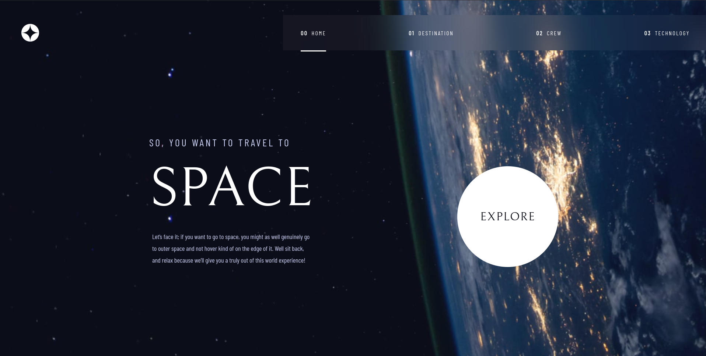

# Frontend Mentor - Space Tourism Website Solution

This is a solution to the [Space tourism website challenge on Frontend Mentor](https://www.frontendmentor.io/challenges/space-tourism-multipage-website-gRWj1URZ3). Frontend Mentor challenges help you improve your coding skills by building realistic projects.

## Table of contents

- [Overview](#overview)
    - [The challenge](#the-challenge)
    - [Screenshots](#screenshots)
    - [Links](#links)
- [My process](#my-process)
    - [Built with](#built-with)
    - [What I learned](#what-i-learned)
- [Author](#author)

## Overview

### The challenge

Users should be able to:

- View the optimal layout for each of the website's pages depending on their device's screen size.
- See hover states for all interactive elements on the page.
- View each page and be able to toggle between the tabs to see new information.

### Screenshots

### Links

- **Solution URL:** [Code](https://github.com/thiagoomatheus/space-tourism-website)
- **Live Site URL:** [Site](https://thiagoomatheus.github.io/projects/space-tourism-website-main/)

## My process

### Built with

* Semantic HTML5 markup
* CSS custom properties (variables)
* Flexbox
* CSS Grid
* Mobile-first workflow
* SASS
* JavaScript (for carousel)

### What I learned

While working on this project, I focused on improving my responsive design skills, which was a key challenge. The provided Figma design file presented a unique learning opportunity; I gained firsthand experience in interpreting and implementing a pre-designed layout. Additionally, managing the various font styles and sizes highlighted the importance of UI/UX in ensuring a visually appealing and user-friendly interface. This project challenged me to think critically about how design choices impact the user experience.

Also, this project was where I had my first contact with JavaScript. During the project I took a break to learn more about JS. Therefore, I could apply the concepts studied in this time.

## Author

- **GitHub:** [Thiago Oliveira Matheus](https://github.com/thiagoomatheus)
- **Frontend Mentor:** [@thiagoomatheus](https://www.frontendmentor.io/profile/thiagoomatheus)
