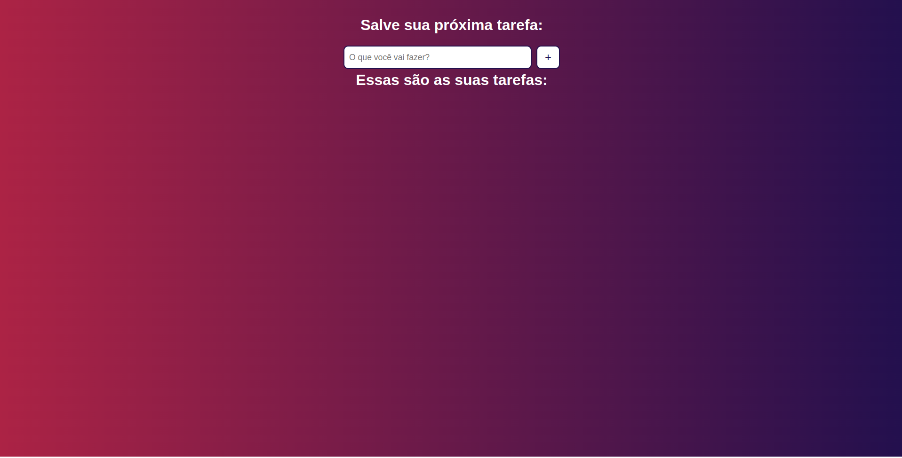
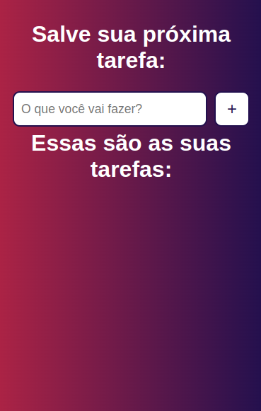

# To Do List

Esse projeto foi realizado como desafio da aula 52 do [Curso JavaScript](https://www.youtube.com/watch?v=KNk0Cex3zcM&list=PLnDvRpP8BneysKU8KivhnrVaKpILD3gZ6&index=52) do canal Matheus Battisti - Hora de Codar.

O projeto servia de base para fixar os conteúdos aprendidos durante o curso.

## O Desafio

Nesse desafio foi recebido o layout do projeto bem como suas funcionalidades que deveriam ser implementadas. Entre as funcionalidades tínhamos a inserção de uma tarefa, a exclusão da mesma e a alteração de seu estado, podendo-se alternar entre concluída ou ainda pendente.

O desafio propunha realizar um CRUD simples de tarefas através de uma variável, criada na abertura da página, que armazenava as tarefas e manipulando esta variável por meio do DOM. 

Foram colocados em prática no projeto, principalmente, os conceitos de eventos do usuário, manipulação de arrays, selecionar e alterar elementos no DOM e validação de dados.

Creio que esse projeto me ajudou a entender conceitos básico do JavaScript que me prepararam para entender conceitos mais profundos.

## Conheça o projeto

[Acesse o projeto no ar aqui](https://thiagoomatheus.github.io/projects/to-do-list/home.html)

[Acesse o código aqui](https://github.com/thiagoomatheus/projects/tree/main/to-do-list)

## Tecnologias/Conhecimentos Utilizados

- HTML Semântico
- CSS Básico
- JavaScrip Básico
    - Variáveis
    - Eventos
    - CRUD
    - Manipulação de Arrays
    - Manipulação de DOM

## Autor

- [thiagoomatheus](https://github.com/thiagoomatheus)
